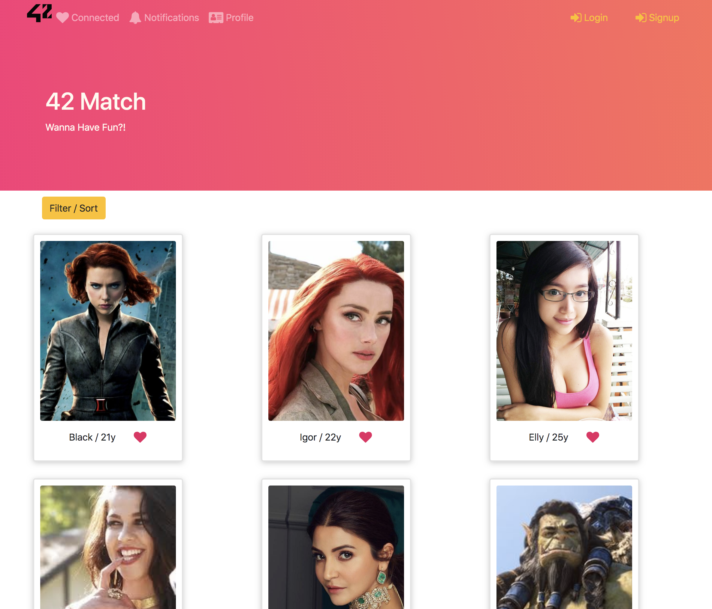
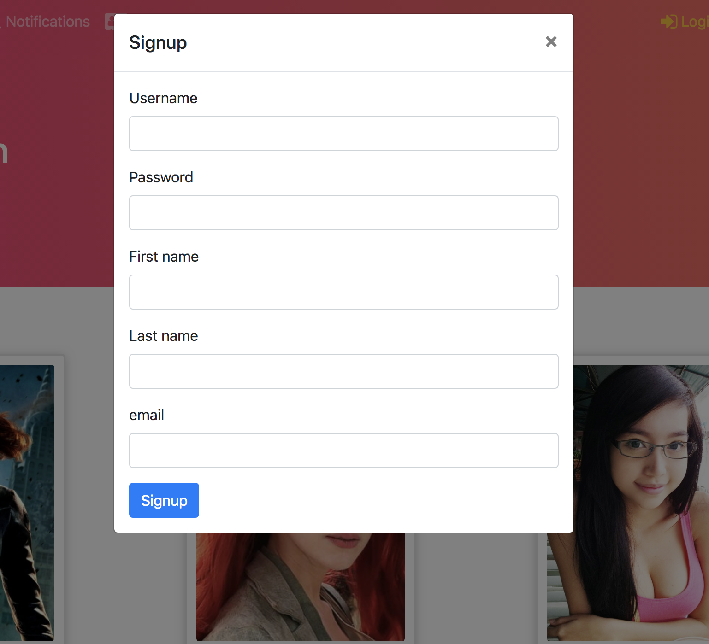
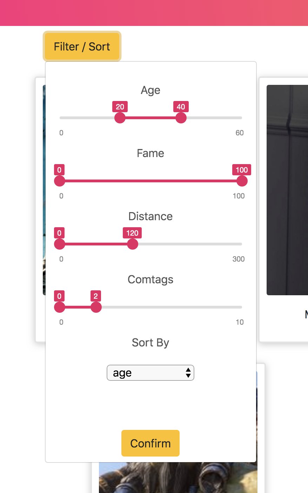
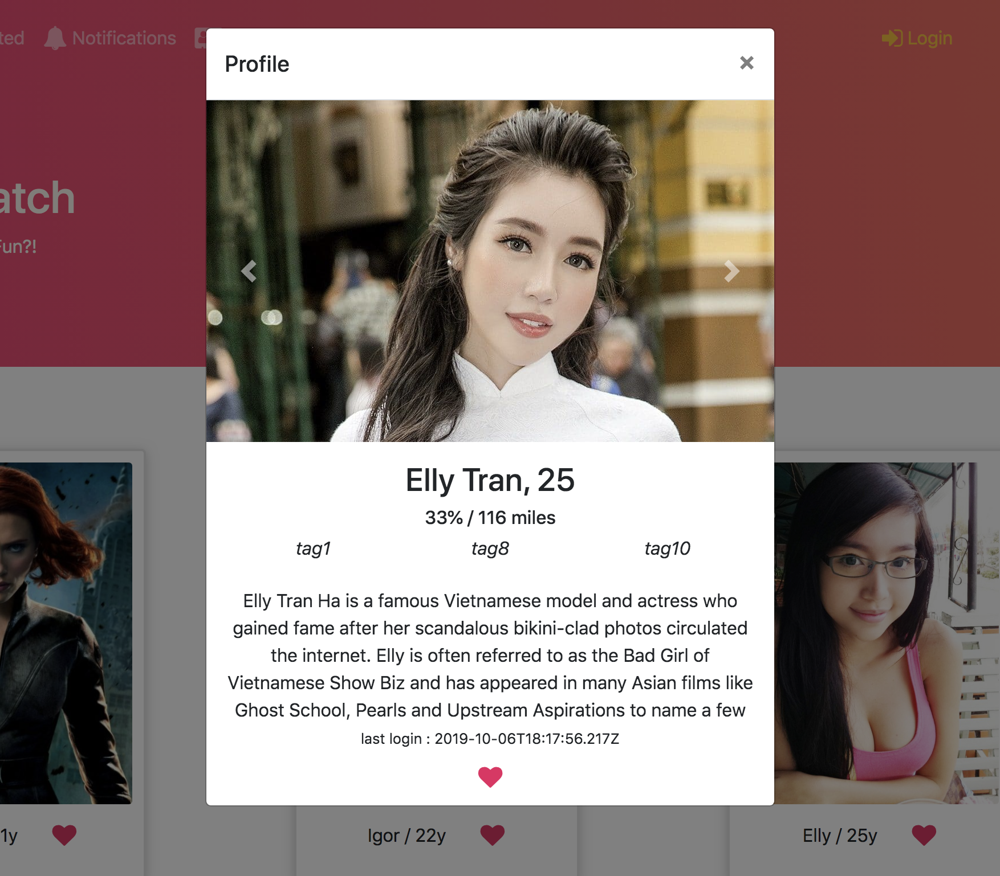
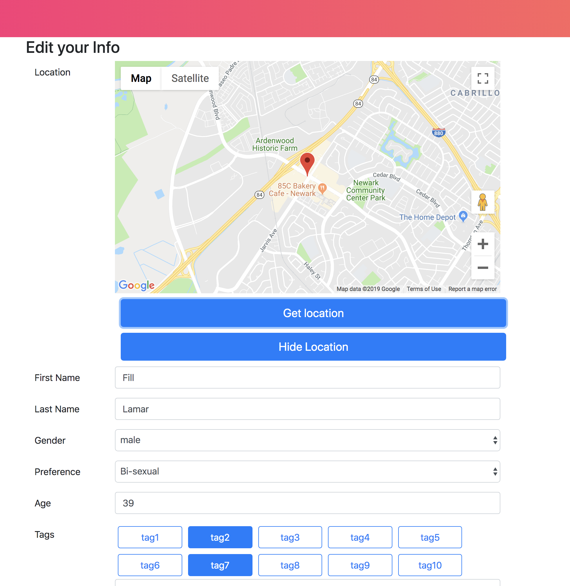
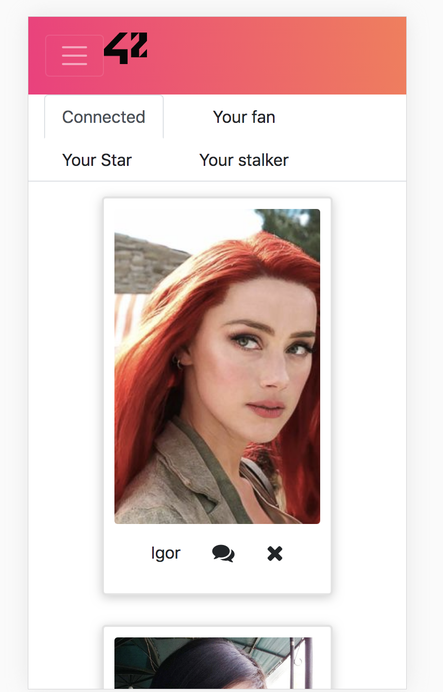
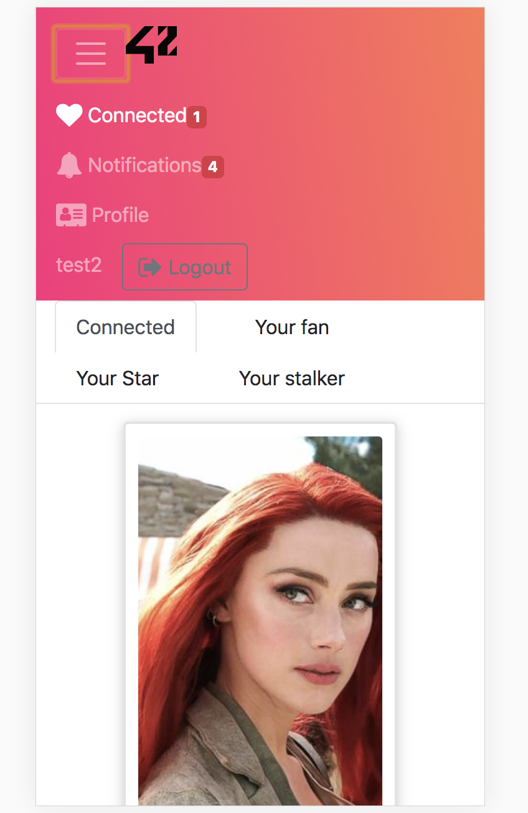

# Matcha

[42 School](https://www.42.us/) project. 
This website is available for test purpose [here](https://ec2-18-220-196-170.us-east-2.compute.amazonaws.com:3001).
Hosted by AWS/EC2

Backend setting is [here](https://github.com/Ultraman82/match-server.git)

## Description

Create a dating WebSite where the user can create his/her profile, search other users, like them and begin a conversation with a chat if the person liked him back.

### Features

- User profile
- Research and filter users
- Real time chat/notification with web socket
- Report fake users
- Hide / Register user location

### Frameworks

- React/Redux
- Bootstrap
- Node.js
- Socket.io
- Express/MongoDB(server side)

## Pictures

### Main page

### Register page

### Users search page with filters

### User profile

### Profile parameters

### Responsive

 

